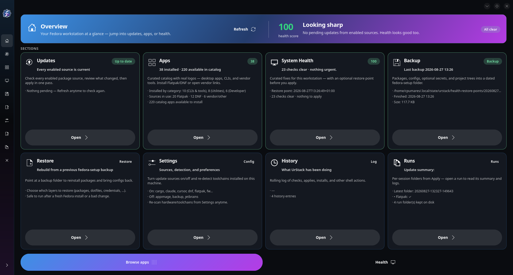
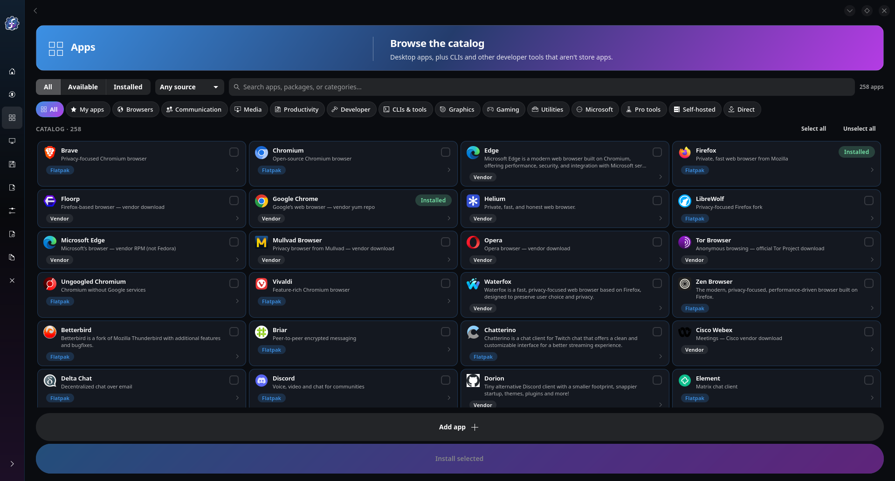
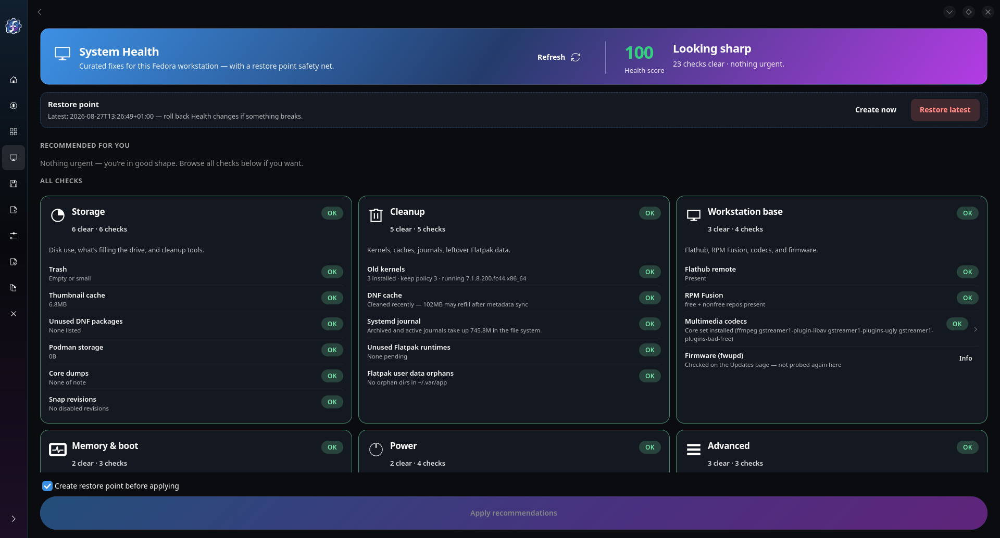
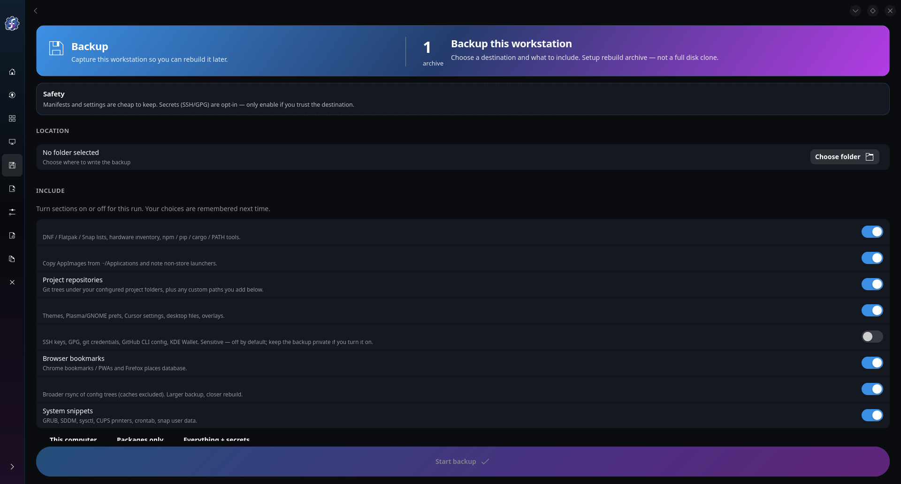

<p align="center">
  
</p>

<h1 align="center">UrStack</h1>

<p align="center">
  <strong>Your Fedora workstation, under one roof.</strong>
</p>

<p align="center">
  <a href="#why-urstack">Why</a> ·
  <a href="#features">Features</a> ·
  <a href="#requirements">Requirements</a> ·
  <a href="#quick-start">Quick Start</a> ·
  <a href="#the-desktop-app">Desktop App</a> ·
  <a href="#screenshots">Screenshots</a> ·
  <a href="#cli-usage">CLI</a> ·
  <a href="#configuration">Configuration</a> ·
  <a href="#roadmap">Roadmap</a> ·
  <a href="CHANGELOG.md">Changelog</a> ·
  <a href="#project-layout">Layout</a> ·
  <a href="#ai-use">AI use</a> ·
  <a href="#contributing">Contributing</a>
</p>

<p align="center">
  
  
  
  
  
</p>

<table id="screenshots">
  <tr>
    <td align="center" width="33%">
      <a href="assets/screenshots/overview.png">
        
      </a>
      <br>
      <sub>Overview</sub>
    </td>
    <td align="center" width="33%">
      <a href="assets/screenshots/apps.png">
        
      </a>
      <br>
      <sub>Apps</sub>
    </td>
    <td align="center" width="33%">
      <a href="assets/screenshots/health.png">
        
      </a>
      <br>
      <sub>Health</sub>
    </td>
  </tr>
</table>

---

**UrStack** is a native GTK4 / libadwaita companion for daily-driver Fedora machines. It checks and applies updates across package managers and developer toolchains, installs popular software from a curated catalog, tunes workstation health, and backs up a machine so you can rebuild it later — from one dashboard, with PolicyKit for privileged steps instead of pasted `sudo` commands.

Launch it as `urstack` or `stackup` (the `fedora-updates` command is kept as a compatibility alias).

---

## Why UrStack

I built this because a fresh Fedora install is a blank machine, and I did not want to clone my disk to get my life back.

I wanted to **take programs, settings, and the shape of the workstation onto a new OS** — reinstall, new SSD, or a different PC — without a full-disk image. A clone copies junk, is slow to move, and is a poor fit when the next box has different storage or a different GPU. A **blueprint** (what is installed, plus the settings that matter) is something you can keep and re-apply.

I also wanted a **unified updater**. Fedora does not have one: DNF, Flatpak, Snap, firmware, and developer tools (npm, pip, rustup, and friends) each have their own command and UI. I wanted one place that checks them together and applies what I choose.

### Problems it solves

| If you are tired of… | UrStack |
| --- | --- |
| Running `dnf`, GNOME Software, Snap, `fwupdmgr`, and toolchain CLIs separately | One Updates page (and CLI) for the whole stack |
| Spending a day reinstalling apps after a clean Fedora | Catalog with descriptions and screenshots, plus backup manifests for batch install |
| Guessing which store has an app, or installing blind | Apps page: summary, full description, and Flathub screenshots before you click Install |
| Not knowing what to clean or tune after months of use | Health scan with a score, optional actions, and undo via restore points |
| Disk clones for “move me to a fresh OS” | Backup / restore as a blueprint, not an image |
| Blind system tweaks with no undo | Health actions with restore points |
| Rebuilding a theme from screenshots and a pile of tars | Look page packs the live wallpaper, icons, and widgets; installs a theme archive or a community GitHub pack (Dracula, Nord, Catppuccin) |
| Pasting `sudo` into a terminal for every privileged step | PolicyKit prompts for DNF, firmware, and similar jobs |

### What it offers

- **Unified updates** — DNF, Flatpak, Snap, firmware, plus optional developer sources, checked in parallel and applied from one dashboard.
- **Rebuild without cloning** — export package lists, projects, AppImages, and desktop settings; restore them on a clean Fedora.
- **Apps with real listings** — a category catalog where each app has a description, screenshots, and the install path that actually works on Fedora (not a raw Flathub dump).
- **Health page** — a scan of cleanup, codecs, memory, and power; you pick the fixes, UrStack takes a restore point before aggressive ones.
- **Native desktop app** — GTK4 / libadwaita, plus a CLI for scripts and a daily check timer.
- **Look packs** — save the live wallpaper, custom icons, widgets, and theme, install a theme archive, or download a community palette from GitHub (Dracula, Nord, Catppuccin, Sweet, Bibata; user-local only).

The sections below are the detail. If you only need a reinstall kit and one updater, start at [Quick Start](#quick-start), then enable Backup in Settings.

---

## Features

### Universal update engine

UrStack aggregates pending updates in parallel and lets you apply them from one place:

- **Core sources:** DNF (dnf / dnf5), Flatpak, Snap, and firmware via `fwupd`.
- **Developer toolchains** (enabled when detected, or from Settings): nvm / npm, pip / pipx, rustup / cargo, Toolbx / Distrobox, Node.js, Cursor, Claude Code, and Supabase CLI.
- **Advisories** (reminders, not auto-applied): JetBrains Toolbox and AppImages under `~/Applications`.
- **PolicyKit:** elevated DNF, Snap, firmware, and similar steps use the native authentication dialog.
- **Play well with other updaters:** optional quieting of GNOME Software while UrStack runs, and DNF excludes for Plasma Discover if you removed it.

Firmware is **checked** by default (`enable_fw`). **Applying** fwupd payloads is off unless you turn on **Apply firmware updates** in Settings, tick Firmware on the Apply screen, or pass `--include-firmware` with `--yes`. A firmware flash may need a reboot.

### Apps catalog (install with previews)

The Apps page is a **download/install browser**, not a dump of every Flathub listing. You pick a category, see what is already installed, and open an app for details before it hits the disk.

Each listing can include:

- **Name, icon, and short summary** so you can scan quickly.
- **Full description** (developer, license, and Flathub/AppStream text where we have it).
- **Screenshots** shown inside UrStack — you can step through them without leaving the app or opening a browser.
- **The install method that actually works on Fedora:** Flatpak (Flathub), DNF, Snap, or a vendor URL / AppImage when that is the realistic Linux path.

**My apps** lists catalog apps that are already on this machine. Open one to **Uninstall** (Flatpak, DNF, Snap, vendor RPM, or AppImage). **Add app** still pins extra Flathub / DNF / Snap names you want that are not in the curated catalog; those listings live in `~/.config/urstack/catalog-user.json` under **Added by you**, show up in My apps once installed, and come back with Backup / Restore. Extra yum, COPR, or Flatpak remotes, vendor scripts, and arbitrary RPM URLs cannot be added from the GUI.

Categories include **My apps** (installed), **Added by you**, browsers, communication, media, productivity, developer (IDEs and GUI tools), **CLIs & tools** (git, gh, language toolchains, terminal utilities), graphics, utilities, gaming, and vendor / direct downloads. Linux-mapped profiles inspired by [Chris Titus Tech’s winutil](https://github.com/ChrisTitusTech/winutil) sit beside the native catalog. Windows-only titles from that list are not imported.

That is the difference after a fresh OS: you rebuild the toolbox by browsing apps you recognize, with pictures and descriptions, instead of remembering package names.

### Health page

The Health page is a **workstation checkup**, not an auto-tweaker. It scans the machine, shows a **health score** on Overview, and lists optional actions you can select.

That helps when Fedora has been running for months (or you just restored a blueprint onto a new disk): old kernels and caches pile up, codecs or Flathub may be missing, memory pressure and power profiles are easy to leave on defaults, and a random blog “optimization” is hard to undo.

| Area | What it is for |
| --- | --- |
| Cleanup | Old kernels, DNF cache, journal vacuum, unused Flatpak runtimes, orphan `~/.var/app` data — reclaim space without guessing commands |
| Workstation | Flathub remote, RPM Fusion, multimedia codecs — the usual “media and apps actually work” baseline |
| Memory | zram-generator, EarlyOOM — stay usable when RAM is tight |
| Power | `power-profiles-daemon` profiles; warn if TLP and ppd both want control |
| Advanced | `fstrim`, DNF parallel downloads, sysctl drop-in (`/etc/sysctl.d/99-urstack.conf`) |

You choose what to apply. Aggressive tweaks take a **restore point** first, under `~/.local/state/urstack/health-restore-points/`. You can list, create, and roll those back from the Health page or the CLI — so Health is a guided cleanup, not a one-way script.

A restore point rolls back:

- UrStack's own drop-ins (`/etc/sysctl.d/99-urstack.conf` and the DNF speed configs)
- `earlyoom` / `tlp` enablement and the `power-profiles-daemon` profile
- User units that a `userunit-*` action disabled
- The DNF transaction, when the point was taken for a package-changing action (old kernels, RPM Fusion, codecs)

It does **not** reinstall packages or Flatpaks removed by other means, and it cannot bring back emptied caches or trash. The RPM and Flatpak lists in the restore point are kept as a record to compare against, not as an automatic rewind.

### Look packs

The Look page is a **theme kit**, not the full Backup blueprint. It reads the desktop that is running (Plasma, GNOME, Cinnamon, XFCE, COSMIC, MATE, LXQt, or Budgie) and packs:

- The wallpaper files actually in use (not just a path)
- Custom icon and cursor themes (Fedora-shipped names like Breeze or Adwaita are recorded, not copied)
- GTK / Plasma look-and-feel, colour schemes, and user-installed widgets
- Desktop settings that select those pieces (`kdeglobals`, appletsrc, GTK, dconf / xfconf)

**Save look pack** writes a `.tar.xz` you can keep or move to another Fedora machine. **Browse themes** is a curated catalog (same idea as Apps), not the GNOME Look / KDE Look feed that Discover already shows. Packs come from GitHub — Dracula, Nordic, Sweet, Catppuccin, Candy icons, Kora, Bibata, Nordzy — and **Install** copies a real archive into your home directory the same way as **Open** + **Install archive**. Installer scripts are never run. Third-party icon, GTK, and Plasma tars/zips are accepted when UrStack can tell what they are. Archives cannot write outside the extract dir and do not install into `/usr`.

Icons, colours, and wallpaper apply immediately when the desktop has a helper (`gsettings`, `plasma-apply-*`). Panels and widgets usually need a log out.

Backup still has a broader “desktop settings” toggle for a full rebuild. Use Look when you want only the appearance.

### Backup and rebuild

Backup is a **blueprint**, not a full-disk image. A dated folder can include:

- Package and CLI manifests (DNF user packages, Flatpak, Snap, npm, pip, pipx, cargo, rustup, nvm, PATH inventory)
- Personal Apps overlay (`catalog-user.json`) so My apps can be reinstalled after a rebuild
- Git repositories under configured project roots (build artefacts such as `node_modules` and `.venv` are skipped)
- AppImages and vendor launchers
- Desktop settings, themes, and browser profiles
- SSH / GPG material, git and GitHub CLI credentials, and KDE Wallet — **opt-in, off by default**; tick *Secrets & identity* on the Backup page (or pass `secrets=1`) to include them
- Hardware / driver inventory so restore can distinguish same-PC vs different-GPU machines

Restore reinstalls from those manifests and overlays settings. Enable the module in Settings or with `--include-backup` when writing a detected config.

---

## Requirements

- **OS:** Fedora Workstation, or another Fedora spin with a GTK4 / libadwaita session (GNOME, KDE Plasma with libadwaita, and similar). Support for other Linux distributions is a goal — see [Roadmap](#roadmap).
- **Runtime:** Python 3, GTK 4, libadwaita. Zenity is an optional fallback for some dialogs if the GTK UI cannot start.
- **Privileges:** user install needs no root. System install and privileged updates use `sudo` / PolicyKit.

rpm-ostree / Silverblue-style immutable Fedora is not the target; UrStack expects a classic DNF workstation.

---

## Quick Start

Clone the repository (or open the project directory) and run the installer:

```bash
git clone https://github.com/CDPumares/urstack.git
cd urstack
./install.sh --user
```

That copies the app under `~/.local/share/urstack`, puts `urstack` / `stackup` on `~/.local/bin`, installs desktop entries and icons, and writes `~/.config/urstack/config.conf` if it does not already exist.

On first install with the default **auto** profile, the installer scans the workstation and enables only the sources it finds (DNF, Flatpak, Snap, fwupd, plus any toolchains present). Existing config is never overwritten.

Then launch from the app menu, or:

```bash
urstack
# or
stackup
```

The installer is meant to be run from a terminal (`./install.sh --user`). A local `Install UrStack.desktop` with an absolute `Icon=` path is machine-specific and is not in git.

### Install modes

```text
./install.sh [--user|--system] [--profile auto|default|developer] [--uninstall]
```

| Option | Effect |
| --- | --- |
| `--user` | Current user only (default). Files under `~/.local`. |
| `--system` | `/usr/local` plus PolicyKit policy (needs sudo). |
| `--profile auto` | Scan this machine and write config (default when config is missing). |
| `--profile default` | Core sources only (DNF, Flatpak, Snap, firmware). |
| `--profile developer` | All plugins on, including backup. |
| `--uninstall` | Remove installed files for the chosen mode. Config and logs are kept. |

After a user install, ensure `~/.local/bin` is on your `PATH`.

### Uninstall

```bash
./install.sh --user --uninstall
# or
./install.sh --system --uninstall
```

Config stays at `~/.config/urstack/config.conf`. Personal Apps listings stay in `~/.config/urstack/catalog-user.json`. Logs stay under `~/.local/state/urstack`.

---

## The desktop app

The main window is a sidebar shell:

| Page | Role |
| --- | --- |
| **Overview** | Snapshot of updates, health score, and recent history. |
| **Updates** | Parallel check, per-source cards, apply selected or all. |
| **Apps** | Category catalog, My apps overlay, filters, single or batch install. |
| **Health** | Scan, pick actions, apply; restore points. |
| **Look** | Pack the live wallpaper, icons, widgets, and theme; install a theme tar/zip. |
| **Backup** / **Restore** | Blueprint export and rebuild. |
| **Settings** | Toggle sources, kernel keep-count, re-scan workstation. |
| **History** / **Runs** | Combined log and per-run folders. |

Checks run in the background after launch. You can open Apps, Look, Backup, Settings, and History while a scan is still finishing.

<p align="center">
  
  <br>
  <sub>Backup — a workstation blueprint; secrets stay off unless you opt in</sub>
</p>

---

## CLI usage

With no flags, UrStack opens the GUI (and detaches from the terminal). Flags stay in the foreground.

```text
urstack                         # GUI, with a grey tray icon while it is open
urstack --page backup           # GUI, opening a specific page
urstack --check                 # Print results; exit 1 if anything is pending
urstack --check --tray          # Same, with the grey tray icon while it scans
urstack --yes                   # Non-interactive apply (skips firmware unless Settings apply_fw=1)
urstack --yes --include-firmware
urstack --log                   # History viewer
urstack --config                # Config path, enabled sources, dump file
urstack --detect                # Scan workstation; print what would be enabled
urstack --detect --write-config
urstack --detect --write-config --include-backup
urstack --backup [dir]
urstack --restore [dir]
urstack --install-timer         # Daily user systemd timer (check only)
urstack --remove-timer
urstack --health-scan --health-status <file>
urstack --health-apply <id,id,…>
urstack --health-restore-point
urstack --health-restore-list
urstack --health-restore [id|latest]
urstack --look-status
urstack --look-export [file]
urstack --look-install <file>
urstack --page look
```

`--check` is suitable for scripts and the daily timer: exit `0` if the stack is current, `1` if updates exist, `3` if another instance holds the lock. `--check --tray` is what login autostart uses in background mode.

The GUI also shows that grey tray icon (`urstack-tray`) while the window is open. Left-click raises UrStack; right-click offers Check, Updates, Apps, Health, Look, Backup, Restore, Settings, and Quit. On Plasma, Cinnamon, XFCE and COSMIC this is a StatusNotifierItem; on GNOME (no tray) a small window sits on the dash instead. The indicator stays until you pick Quit from its menu, so you can close the window and reopen from the tray.

### Daily check timer

```bash
urstack --install-timer
urstack --remove-timer
```

Installs a user unit `urstack-check.timer` (`OnCalendar=daily`, randomized delay). It only **checks** and notifies; it does not apply updates. Legacy `stackup-check.timer` / `fedora-updates-check.timer` units are disabled. The same timer can be toggled from Settings → Daily silent check.

---

## Configuration

User config (created on first run / install):

```text
~/.config/urstack/config.conf
~/.config/urstack/catalog-user.json   # optional My apps overlay
```

Keys are `1` / `0`. Shipped templates live in `config/default.conf` and `config/developer.conf`. Settings in the GUI write the same file (with a timestamped `.bak-*` copy).

### Core

| Key | Default | Meaning |
| --- | --- | --- |
| `enable_dnf` | 1 | RPM updates |
| `enable_flatpak` | 1 | Flatpak apps and runtimes |
| `enable_snap` | 1 | Snap refresh |
| `enable_fw` | 1 | Check fwupd for device firmware |
| `apply_fw` | 0 | Apply firmware when updating (Settings toggle; also `--include-firmware`) |
| `enable_kernel_prune` | 1 | Drop old kernels after DNF (see `keep_kernels`) |
| `exclude_discover` | 1 | DNF `--exclude` for Plasma Discover packages |
| `quiet_gnome_software` | 1 | Pause GNOME Software’s background service during a GUI run |
| `keep_kernels` | 3 | Kernels to keep when pruning |
| `autostart` | 0 | Launch UrStack at login (`~/.config/autostart/urstack.desktop`) |
| `autostart_background` | 0 | With autostart: run `urstack --check --tray` instead of opening the window |
| `scan_on_startup` | 1 | Run update and health scans when the app window opens |
| `daily_check` | 0 | User systemd timer that checks once a day and notifies (does not apply) |
| `notifications` | 1 | Desktop notifications when updates are found or an apply finishes |

### Plugins

| Key | Default | Meaning |
| --- | --- | --- |
| `enable_toolbox` | 0 | Toolbx / Distrobox |
| `enable_npm` / `enable_npm_user` | 0 | nvm global npm / `~/.local` npm |
| `enable_pip` / `enable_pipx` | 0 | pip `--user` / pipx |
| `enable_rust` / `enable_cargo` | 0 | rustup / `cargo install` |
| `enable_node` | 0 | nvm Node version vs latest |
| `enable_cursor` / `enable_claude` / `enable_supabase` | 0 | Editor / CLI updaters |
| `enable_jetbrains` / `enable_appimage` | 0 | Advisories only |
| `enable_backup` | 0 | Backup / restore module |

### Backup paths

| Key | Default | Meaning |
| --- | --- | --- |
| `backup_project_roots` | `Documents:Projects:src:Desktop:waydroid_script` | Colon- or comma-separated; relative to `$HOME` or absolute |
| `backup_project_depth` | 3 | How deep to search each root for git repos (1–6) |
| `backup_full_dotconfig` | 1 | Also rsync most of `~/.config` and `~/.local/share` (caches excluded) |

Re-scan and rewrite config (backs up the previous file):

```bash
urstack --detect --write-config
```

Legacy `~/.config/stackup/` and `~/.config/fedora-workstation-updater/` are copied to `~/.config/urstack/` once if the new directory does not exist.

### Runtime paths

| What | Where |
| --- | --- |
| User config | `~/.config/urstack/config.conf` |
| My apps overlay | `~/.config/urstack/catalog-user.json` |
| Logs | `~/.local/state/urstack/` (`urstack.log` and per-run folders) |
| Health restore points | `~/.local/state/urstack/health-restore-points/` |
| User install | `~/.local/share/urstack/` |
| System install | `/usr/local/share/urstack/` |
| Lock | `$XDG_RUNTIME_DIR/urstack-$UID.lock` |

---

## Project layout

```text
bin/urstack              Entry point (GUI + CLI)
bin/stackup              Compatibility wrapper
bin/fedora-updates       Compatibility wrapper
install.sh               User / system installer
config/                  default.conf, developer.conf
data/catalog/            apps.json, themes.json, winutil.json, icon-map.json, metadata.json, icons/
data/icons/              Application icons (hicolor)
data/polkit/             PolicyKit policy (system install)
lib/core/                checks, apply, catalog, detect, priv, look packs, GTK UI
lib/plugins/             health.sh, backup.sh
scripts/                 Catalog / icon-map helpers
tests/                   Parser unit tests
packaging/NOTES.md       RPM / Flatpak notes
CHANGELOG.md             Version history (Keep a Changelog)
```

Privileged work is batched through `lib/core/priv.sh` (pkexec). The GTK UI is `lib/core/ui.py`.

Flatpak packaging is a poor fit: DNF and fwupd need host privileges. An RPM (for example via Copr) wrapping this tree is the intended distribution path; see `packaging/NOTES.md`.

---

## Roadmap

UrStack is Fedora-first today. I want to add **other Linux operating systems** so this is not a Fedora-only tool — Ubuntu, Debian, Arch, openSUSE, and the rest should be able to use the same app for updates, the catalog, health, and backup.

The GTK desktop, Flatpak/Snap/firmware, and much of the catalog already travel well. What still needs work is distro-native packages (DNF vs apt vs pacman vs zypper), PolicyKit helpers, health checks, and restore. Help on those ports is welcome.

---

## Changelog

What shipped in each version is in [CHANGELOG.md](CHANGELOG.md). GitHub’s [Releases](https://github.com/CDPumares/urstack/releases) tab is the same list once a version is tagged (`v0.3.0`, …).

**Current:** 0.3.0 — tray icon, login/daily checks, My apps, secrets opt-in, and the safety fixes from the 2026-08-27 pass.

---

## AI use

Most of this repository was written with AI coding assistants, under my direction. I set the product goals, reviewed the output, and I am responsible for what ships.

That is here so users and contributors are not guessing. Please treat the code the same way you would any other project: read the parts you rely on, run the tests, and open an issue or a PR if something is wrong.

---

## Contributing

Bug reports, catalog additions, distro ports, and patches are welcome. See [CONTRIBUTING.md](CONTRIBUTING.md) for setup, tests, and the PolicyKit rules.

- [Open an issue](https://github.com/CDPumares/urstack/issues/new/choose)
- Keep privileged operations in `lib/core/priv.sh`
- Do not add `auth_admin_keep` to PolicyKit policy

Parser tests (need GTK / libadwaita on the machine):

```bash
python3 -m unittest tests.test_parsers
```

Catalog maintenance helpers:

```bash
python3 scripts/import-winutil-apps.py
python3 scripts/build-icon-map.py
python3 scripts/vendor-app-icons.py
python3 scripts/vendor-app-metadata.py
```

`vendor-app-metadata.py` pulls Flathub AppStream (description, developer, license, links, screenshot URLs) into `data/catalog/metadata.json`. Screenshot images are cached on first view under `~/.cache/urstack/app-meta/`.

---

## License

MIT. Use, fork, and adapt freely.
